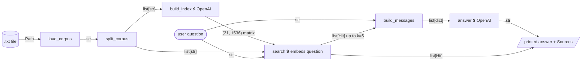

# Pipeline

```mermaid
flowchart LR
    file[(".txt file")] -->|"Path"| load["load_corpus"]
    load -->|"str"| split["split_corpus"]
    split -->|"list[str]"| build["build_index 💲 OpenAI"]
    build -->|"(21, 1536) matrix"| search["search 💲 embeds question"]
    split -->|"list[str]"| search
    question(["user question"]) -->|"str"| search
    question -->|"str"| msgs["build_messages"]
    search -->|"list[Hit] up to k=5"| msgs
    msgs -->|"list[dict]"| answer["answer 💲 OpenAI"]
    answer -->|"str"| out[/"printed answer + Sources"/]
    search -->|"list[Hit]"| out
```
